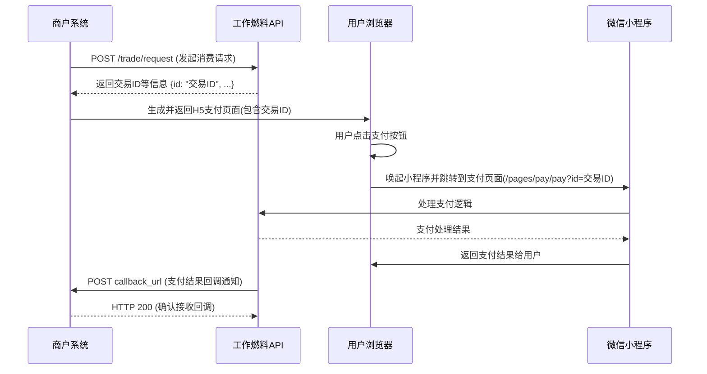

# 支付流程示例

## 概述

本文档展示了第三方商户如何通过H5页面唤起小程序完成支付的完整流程。商户需要先调用API发起消费请求，然后使用返回的交易ID唤起小程序支付页面。

## 支付流程

完整的支付流程如下：

1. 第三方商户后台调用 [/trade/request](./request-trade.md) 接口发起消费请求
2. 系统返回交易信息，包括交易ID
3. 第三方商户将用户引导至H5支付页面
4. 用户在H5页面点击支付按钮
5. H5页面通过微信API唤起小程序支付页面
6. 用户在小程序中完成支付
7. 系统通过 [/callback](./callback.md) 通知商户支付结果

## 调用逻辑时序图



## H5支付页面示例

以下是一个标准的H5支付页面示例：

```html
<!doctype html>
<html lang="en">
  <head>
    <meta charset="UTF-8" />
    <meta name="viewport" content="width=device-width, initial-scale=1.0" />
    <title>支付页面</title>
    <script type="text/javascript" src="https://res.wx.qq.com/open/js/jweixin-1.3.2.js"></script>
  </head>
  <body>
    <button onclick="pay()">支付订单</button>
    <script>
      // 交易ID，通过调用 /trade/request 接口获得
      const id = "交易ID";
      
      function pay() {
        // 检查是否在小程序环境
        wx.miniProgram.getEnv((res) => {
          if (res.miniprogram) {
            // 唤起小程序支付页面
            wx.miniProgram.navigateTo({
              url: `/pages/pay/pay?id=${id}`,
            })
          } else {
            // 如果不在小程序环境中，提示用户
            alert("请在微信小程序中打开此页面");
          }
        })
      }
    </script>
  </body>
</html>
```

## 实现步骤

### 1. 发起消费请求

首先，商户后台需要调用 [/trade/request](./request-trade.md) 接口发起消费请求：

```bash
curl -X POST https://your-domain.com/trade/request \
  -H "Authorization: Bearer {token}" \
  -H "Content-Type: application/json" \
  -d '{
    "billId": "20230405001",
    "userId": 1405452730637488142,
    "income": 0,
    "expense": 1000,
    "title": "商品购买",
    "body": "购买商品明细",
    "timestamp": 1680691234567,
    "callback": "https://yourdomain.com/callback"
  }'
```

### 2. 处理响应

系统会返回如下格式的响应：

```json
{
  "c": 0,
  "m": "success",
  "d": {
    "id": 1405452730637488143,
    "billId": "20230405001",
    "userId": 1405452730637488142,
    "userName": "张三",
    "income": 0,
    "expense": 1000,
    "balance": 5000,
    "createdAt": "2023-04-05T12:00:00"
  }
}
```

### 3. 生成支付页面

商户需要将响应中的 [id](file:///Users/tomsean/projects/zhile/workerfuel/workerfuel-api/src/main/kotlin/com/zl/wkf/model/resp/CallbackResp.kt#L8-L8) 字段值填入H5支付页面中，生成用户访问的支付页面。

### 4. 用户支付

用户访问支付页面并点击支付按钮后，将唤起小程序完成支付操作。

### 5. 接收回调

支付完成后，系统会向商户在请求中指定的 [callback](file:///Users/tomsean/projects/zhile/workerfuel/workerfuel-api/src/main/kotlin/com/zl/wkf/model/PrepaidRequest.kt#L19-L19) 地址发送支付结果通知：

```json
{
  "trade": {
    "id": 1405452730637488143,
    "userId": 1405452730637488142,
    "userName": "张三",
    "billId": "20230405001",
    "income": 0,
    "expense": 1000,
    "balance": 5000,
    "title": "商品购买",
    "body": "购买商品明细",
    "amount": null,
    "tradeMethod": "THIRD_PARTY",
    "payMethod": "FULL_COIN",
    "tradeState": "PAID",
    "paidAt": "2023-04-05T12:05:00",
    "cancelledAt": null,
    "writeOff": true,
    "writeOffAt": "2023-04-05T12:05:00",
    "channelId": 1405452730637488144,
    "channelType": "SUPPLIER",
    "createdBy": 1405452730637488145,
    "createdAt": "2023-04-05T12:00:00"
  },
  "state": "PAY_SUCCESS",
  "at": "2023-04-05T12:05:00",
  "message": "支付成功"
}
```

## 注意事项

1. H5页面必须在微信环境中打开才能正常唤起小程序
2. 交易ID是临时有效的，建议在生成页面后尽快使用
3. 商户需要确保回调接口能够正确处理支付通知
4. 建议商户对重复通知做幂等处理
5. 如果支付失败，用户可以重新发起支付流程